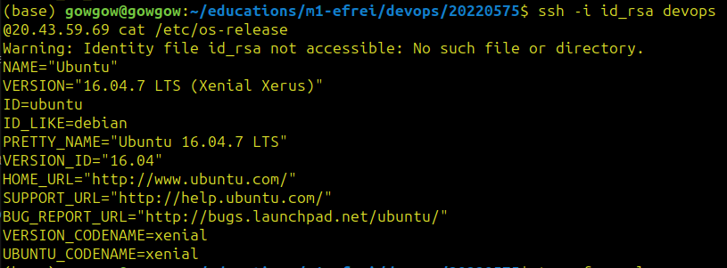

# Rapport TP4

Ce rapport présente étape par étape du processus de déploiement et met en évidence les avantages de l'utilisation de Terraform pour le déploiement de ressources cloud par rapport à la CLI ou à l'UI.

## Etapes

### 1. Configuration du fournisseur
La configuration du fournisseur est définie sur "azurerm", ce qui indique l'utilisation du fournisseur Azure pour Terraform.

### 2. Sources de données
Deux sources de données sont définies pour récupérer des informations sur les ressources Azure existantes :
- `azurerm_resource_group.dzung_resource_group` récupère les détails du groupe de ressources "ADDA84-CTP".
- `azurerm_virtual_network.dzung_virtual_network` récupère des informations sur le réseau virtuel "network-tp4".

### 3. Création de ressource IP publique
`azurerm_public_ip.dzung_public_ip` définit une adresse IP publique statique "dzung-publicip-tp4". Elle utilise une méthode d'allocation définie sur "Static" qui permet de ne pas cacher cette adresse IP.

### 4. Création de ressource Interface réseau
`azurerm_network_interface.dzung_network_interface` définit une interface réseau "dzung-nic-tp4". Elle est configurée avec une configuration IP qui fait référence à l'ID de sous-réseau récupéré à partir de `azurerm_subnet.dzung_subnet`. Elle fait également référence à la ressource IP publique créée précédemment.

### 5. Création de ressource Machine virtuelle Linux
`azurerm_linux_virtual_machine.dzung_linux_virtual_machine` définit une machine virtuelle Linux "devops-20220575". Elle fait référence à l'ID de l'interface réseau créée précédemment. La clé publique SSH pour l'utilisateur administrateur est fournie dans le fichier `id_rsa.pub`.

### 6. Sortie
Le bloc `output` définit une variable de sortie "public_ip_address" qui capture l'adresse IP publique de la machine virtuelle déployée.

## Lancement

L'ordre des commandes à lancer :

### 1. Se connecter à l'Azure
```
az login
```
Cette commande permet d'accéder et de gérer les ressources d'un abonnement actif de l'utilisateur.

### 2. Initialiser un nouveau répertoire Terraform
```
terraform init
```
Cette commande vérifie et télécharge les fournisseurs de ressources spécifiés dans les fichiers de configuration Terraform

###  3. Générer un plan d'exécution
```
terraform plan
```
Cette commande analyse les fichiers de configuration et compare l'état actuel de l'infrastructure avec l'état souhaité défini dans ces fichiers. Le plan affiche les actions que Terraform prévoit de prendre pour atteindre l'état souhaité, telles que la création, la mise à jour ou la suppression de ressources.

### 4. Appliquer les changements requis pour atteindre l'état souhaité de l'infrastructure
```
terraform apply
```
Cette commande exécute le plan généré précédemment et demande une confirmation avant d'apporter les modifications. Une fois confirmée, Terraform déploie ou met à jour les ressources selon les spécifications définies dans les fichiers de configuration.

### 5. Récupérer l'output
```
terraform output
```
Cette commande affiche les outputs définies dans la configuration, ici l'adresse IP publique. Les outputs sont des valeurs calculées ou récupérées à partir de l'état des ressources après l'exécution de `terraform apply`.

### 6. Etablir une connexion SSH avec la machine virtuelle déployée
```
ssh -i id_rsa devops@{public_ip_address} cat /etc/os-release
```
Après avoir remplacé le champ "public_ip_address" par l'output précédent, en utilisant la clé privée spécifiée, cette commande affiche ensuite le contenu du fichier /etc/os-release sur la machine virtuelle. Cela permet de vérifier quelle version du système d'exploitation est installée sur la machine virtuelle.

Voici le résultat :



### 7. Détruire l'infrastructure déployée
```
terraform destroy
```
Cette commande annule toutes les ressources créées en supprimant toutes les ressources gérées dans le fichier d'état.

## Utilisation de Terraform
Terraform a été choisi comme outil de déploiement des ressources Azure parce qu'elle a plus d'avantages que la CLI ou l'UI :

1. **IaC** : Offrir les avantages du contrôle de version, de la collaboration et de la reproductibilité.

2. **Configuration déclarative** : Gérer la création, la modification et la suppression des ressources tout en maintenant l'état souhaité.

3. **Prise en charge multi-cloud** : Permettre d'utiliser le même langage de configuration et le même flux de travail sur différents environnements cloud.

4. **Gestion des dépendances** : Garantir une séquence appropriée et réduisant les erreurs lors du déploiement.

5. **Opérations idempotentes** : L'exécution multiple de la même configuration produit le même résultat, ce qui le rend adapté à l'automatisation et aux pipelines de CI ou de CD.

6. **Flux de travail de planification et d'application** : Permettre de prévisualiser les modifications qui seront appliquées avant de les exécuter, ce qui permet de revoir et de valider les modifications de l'infrastructure.

7. **Gestion de l'état** : Maintenir un fichier d'état qui suit les ressources et leurs configurations.